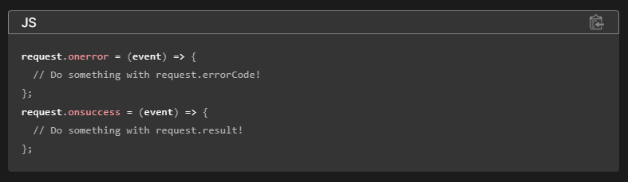
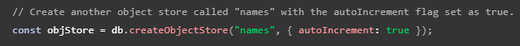

## Patrón básico de IndexedDB:

* Abrir la base de datos.
* Crear un ObjectStore en la base de datos.
* Comenzar una operación en la base de datos.
* Esperar a que la operación termine.
* Trata los resultados.

## Handlers: onsuccess y onerror.

* onsuccess -> Evento que se dispara cuando una operación en IndexedDB se completa con éxito.
* onerror -> Evento que se dispara cuando una operación en IndexedDB falla debido a un error.

## Evento: onupgradeneeded

Cuando creas una nueva base de datos o incrementas el número de versión de una base de datos existente (al especificar un número de versión más alto que el que usaste previamente al abrir una base de datos), se activará el evento "onupgradeneeded".

En el controlador de eventos para el evento "upgradeneeded", debes crear los objectStore necesarios para esta versión de la base de datos.

## Clave autogenerada

Establecer la clave con "autoincrement" al crear el objectStore habilitaría que la clave se autogenerase. Por defecto, esta no está activado.

## Añadir, borrar y actualizar

* add -> Agrega un nuevo registro a un objectStore.
  * Si intentas agregar un registro con una clave (clave primaria) que ya existe en el almacén de objetos, se generará un error y no se realizará la inserción.
* delete -> Elimina un registro de un objectStore a través de su clave primaria.
* put -> Actualiza un registro en un almacén de objetos o lo agrega si el registro no existe.

## Bibliografía

https://developer.mozilla.org/en-US/docs/Web/API/IndexedDB_API/Using_IndexedDB
